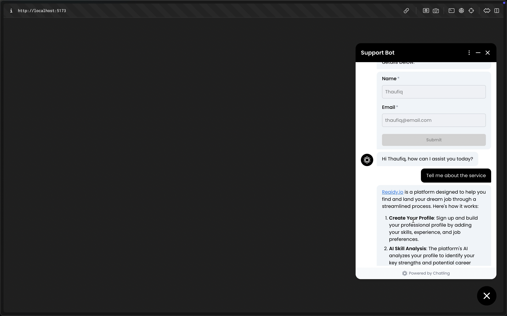

# reaidy.io AI Customer Support Chat Assistant

## Description

This tool helps visitors to the page ask questions in Natural language and let AI that is trained our
the website data answer the questions

## Tech Used

### AI:
Chatling AI (powered by GPT-4o)
## Database:
Chatling’s Conversation Dashboard
### Frontend:
Minimal React Setup
### Runtime:
- Node.js
-  Bun
### Features:
- Login when new chat is initiated
- Typing indicators when the bot is generating a response
- Autoscroll to latest chat
## Challenges faced:

Finding the right AI model that acts as both customer support bot as well as a Natural language
processor. GPT 4o and 3.5 were too powerful and raw and needed to be trained on the data.
While Azure on the other hand lacks basic onboarding capabilities.